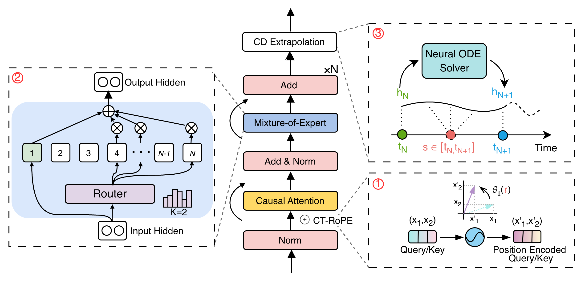
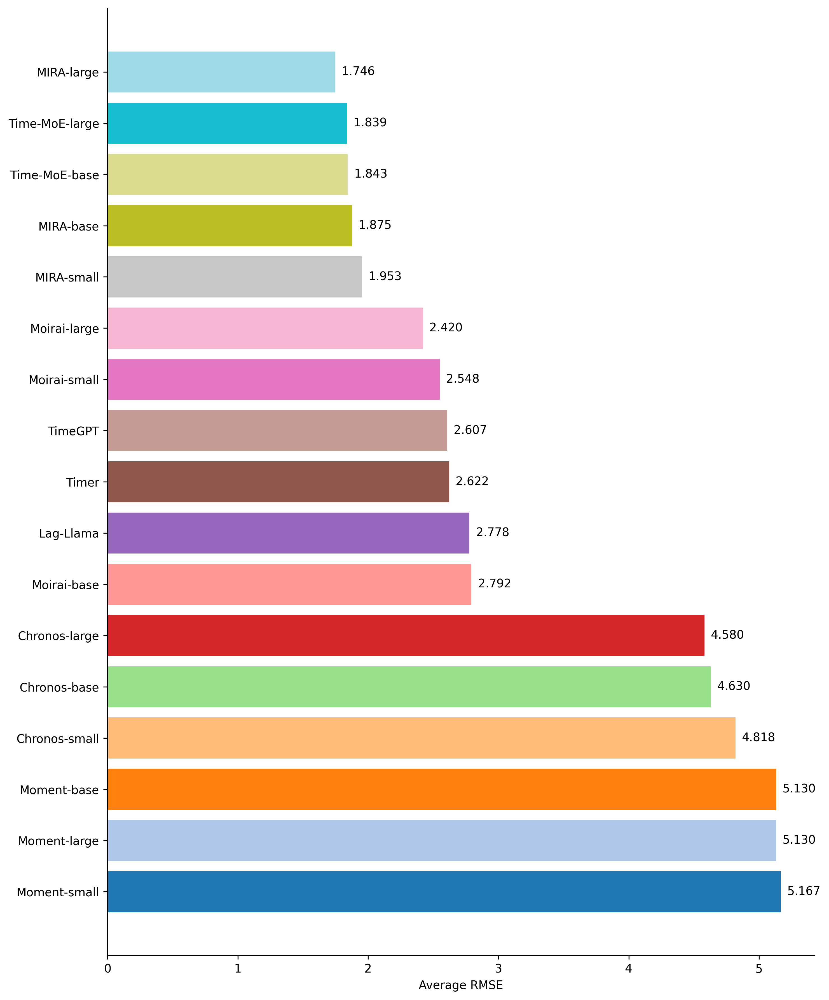
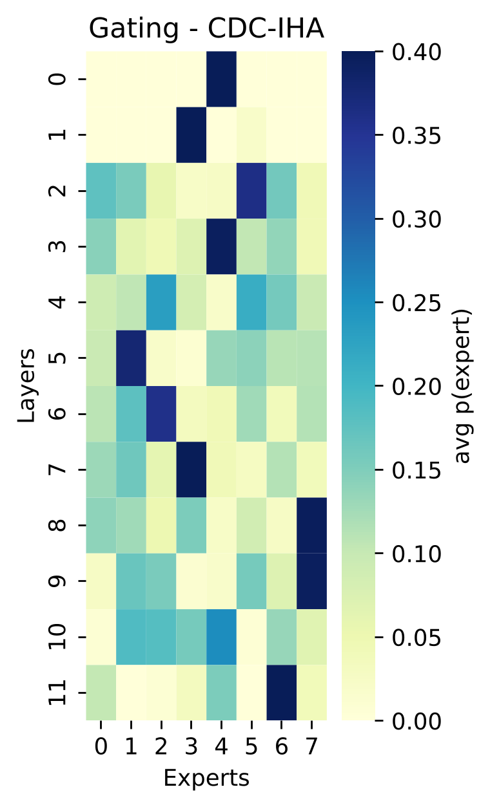

<div align="center">
  <h2><b>(NeurIPS '25) MIRA: Medical Time Series Foundation Model for Real-World Health Data </b></h2>
</div>

<div align="center">

**[<a href="https://arxiv.org/abs/2506.07584">Paper Page</a>]**

</div>

## Overview
MIRA is a foundation model for medical time-series, designed to learn a unified representation space across heterogeneous clinical datasets and support zero-shot forecasting in real-world healthcare settings. Unlike conventional time-series models that operate on fixed sampling rates or task-specific feature spaces, MIRA is built to handle irregular and clinically diverse signals natively. By combining continuous-time encoding, frequency-aware specialization, and neural dynamics modeling, MIRA generalizes robustly across conditions.

MIRA is pretrained on 454B time points collected from large-scale clinical corpora spanning both ICU physiological signals and hospital EHR time-series, covering a rich range of sampling frequencies (minute-level vitals, hourly labs, waveform segments, and multi-day clinical indicators). This large and heterogeneous training distribution allows MIRA to serve as a unified backbone capable of strong out-of-distribution generalization. In extensive evaluations, MIRA achieves state-of-the-art zero-shot forecasting performance across diverse clinical benchmarks. Compared with existing foundation models, MIRA obtains SOTA results on 4 of 5 out-of-distribution evaluation settings on standard baselines—demonstrating strong robustness under dataset shift, irregular sampling, and multimodal temporal variations.

**Key features**
- Continuous-Time Rotary Positional Encoding (CT-RoPE)
Provides a principled way to embed irregular timestamps while preserving temporal geometry, enabling robust reasoning across arbitrary sampling patterns.
- Frequency-specialized Mixture-of-Experts
Allows different experts to specialize on physiological signs, improving transfer across diverse clinical signals.
- Neural ODE Extrapolation
Models latent dynamics continuously over time, enabling forecasting at arbitrary future timestamps.

<p align="center">
  
</p>

---

## Installation

Install Python 3.10+, and then install the dependencies:

```shell
pip install -r requirements.txt
pip install torchdiffeq
```

**Note: MIRA requires `torchdiffeq` for ODE.**

---
## Data Preparation

### Data format example

Each line represents one sample and must contain at least `sequence` and
`time` fields:

``` json
{"sequence": [1.0, 1.2, 0.8, ...], "time": [0.12, 0.22, 0.41, ...], "mask": [1,1,1,...]}
{"sequence": [5.1, 5.0, 5.3, ...], "time": [1, 2.1, 3.1, ...], "mask": [1,1,1,...]}
```
---
## Training

MIRA can be trained on either CPU or GPU environments. The training script automatically handles model initialization, dataset loading, and checkpointing. Below we provide example commands for common setups. For training on irregular medical data:

```bash
python torch_dist_run.py main.py \
  --from_scratch \
  -d ./yourdata.jsonl \
  --output_path ./saveyoucheckpoints \
  --save_steps 10000 \
  --save_strategy steps \
  --save_total_limit 10 \
  --save_only_model \
  --precision bf16 \
  --time_aware_dataset \
  --time_aware_rotary
```

### CPU

If you prefer to train on CPU, simply point the script to your dataset directory:
```bash
python main.py -d <data_path>
```

### GPU
The project includes a lightweight launcher that wraps PyTorch distributed training. On a machine with one or multiple GPUs, launch training via:
```bash
python torch_dist_run.py main.py -d <data_path>
```

For multi-node setups, standard PyTorch elastic variables must be configured.

```bash
export MASTER_ADDR=<master_addr>
export MASTER_PORT=<master_port>
export WORLD_SIZE=<world_size>
export RANK=<rank>
python torch_dist_run.py main.py -d <data_path>
```

To training from scratch, please include the --from_scratch argument in your command. 

```bash
python torch_dist_run.py main.py -d <data_path> --from_scratch
```

For full argument list:

```bash
python main.py --help
```


## Inference

Below is an exmaple how to doing inference. 

```bash
import torch
from MIRA.mira.models.modeling_mira import MIRAForPrediction
from MIRA.mira.models.utils_time_normalization import normalize_time_for_ctrope

seq  = torch.tensor([[...]], dtype=torch.float32)      
time = torch.tensor([[...]], dtype=torch.float32)     

C = 12   # history length
P = 6    # forecast horizon
T = seq.shape[1]

attn = torch.ones_like(time)

full_scaled_times, t_min, t_max = normalize_time_for_ctrope(
    time_values=time,
    attention_mask=attn,
    seq_length=T,
    alpha=1.0,
)

hist_times   = full_scaled_times[:, :C]
future_times = full_scaled_times[:, C:C+P]

mean = seq.mean(dim=1, keepdim=True)
std  = seq.std(dim=1, keepdim=True) + 1e-6

seq_norm  = (seq - mean) / std
hist_vals = seq_norm[:, :C]

ckpt_path = "/checkpoint"
model = MIRAForPrediction.from_pretrained(ckpt_path).cuda()
model.eval()

device = next(model.parameters()).device
hist_vals    = hist_vals.to(device)
hist_times   = hist_times.to(device)
future_times = future_times.to(device)

cur_vals  = hist_vals.clone()
cur_times = hist_times.clone()

preds_norm = []

for i in range(P):

    # model input
    inp_vals  = cur_vals.unsqueeze(-1)   # [1, L, 1]
    inp_times = cur_times                # [1, L]

    with torch.no_grad():
        out = model(
            input_ids=inp_vals,
            time_values=inp_times,
            next_target_time_values=None,  # no ODE for 1-step
            return_dict=True,
        )

    next_norm = out.logits[:, -1, :]     # [1, 1]
    preds_norm.append(next_norm.squeeze(0))

    next_t = future_times[:, i:i+1]

    cur_vals  = torch.cat([cur_vals, next_norm], dim=1)
    cur_times = torch.cat([cur_times, next_t], dim=1)


preds_norm = torch.stack(preds_norm, dim=1)   # [1, P]

preds = preds_norm * std[:, :, :] + mean[:, :, :]
preds = preds.squeeze(0)
print(preds)
```
You can also refer to 

```bash
python model_eval.py 
```

## Datasets

> **Note:** All datasets used in this project are clinical or physiological time-series datasets. Because these datasets contain sensitive human subject information, they are governed by strict data-use agreements (DUA) and protected access policies. Therefore, the raw datasets cannot be redistributed in this repository. You must apply for access through the official data providers listed below.

- **MIMIC** — 
Access link: https://physionet.org/content/mimiciv/
- **WAVES Pediatric Waveform Database** — 
Access link: https://redivis.com/WAVES/datasets
- **PTB-XL** — 
Access link: https://physionet.org/content/ptb-xl/1.0.3/
- **Sleep-EDF** — 
Access link: https://physionet.org/content/sleep-edfx/1.0.0/

## Performance

### Out-of-Distribution Generalization

Generalization is essential for real-world medical AI systems.  Unlike domain-specific time-series models that require retraining, MIRA provides **zero-shot forecasting capabilities** on new hospitals, new patient cohorts, and new physiological variables—without any fine-tuning. 

This makes MIRA particularly suitable for:
- health systems with limited labeled data  
- rapid deployment on unseen clinical tasks 


<p align="center">
  
</p>

To evaluate its robustness, we test MIRA on **unseen downstream clinical datasets** that do not overlap with the 454B time points used during pre-training (covering ICU physiological waveforms and hospital EHR time-series). The figure reports the **average RMSE across a diverse collection of medical forecasting tasks**, comparing MIRA against recent foundation models.  **MIRA achieves the best overall OOD performance**, outperforming all baselines on out-of-distribution settings.  

### Frequency-Specialized Mixture-of-Experts (MoE)

To understand how MIRA allocates computation across different temporal resolutions, we visualize the **expert gating patterns** on two datasets with **distinct time frequencies**:

- **CDC-IHA** — weekly epidemiological signals (low-frequency)  
- **MIT-BIH Arrhythmia** — ~250Hz ECG waveforms (high-frequency)

<table>
<tr>
<td align="center"><b>CDC-IHA (Weekly)</b><br>

</td>
<td align="center"><b>MIT-BIH (High-Frequency)</b><br>

</td>
</tr>
</table>

The MoE module in MIRA exhibits **clear selective activation**, showing that different experts specialize in different temporal regimes. The gating heatmap shows that CDC-IHA predominantly activates a small, consistent subset of experts across layers.  This reflects **low-frequency specialization**, where long-horizon patterns dominate and only a few experts handle the smoother temporal dynamics. In contrast, MIT-BIH exhibits much more **distributed expert routing**, with activations spread across many experts and layers.   This corresponds to modeling fine-grained, high-resolution physiological waveforms.

## Citation

> Please let us know if you find out a mistake or have any suggestions!

> If you find the MIRA models helpful in your research, please consider to star this repository and cite the
> corresponding [paper](https://arxiv.org/abs/2506.07584):

```
@article{li2025mira,
  title={MIRA: Medical Time Series Foundation Model for Real-World Health Data},
  author={Li, Hao and Deng, Bowen and Xu, Chang and Feng, Zhiyuan and Schlegel, Viktor and Huang, Yu-Hao and Sun, Yizheng and Sun, Jingyuan and Yang, Kailai and Yu, Yiyao and others},
  journal={arXiv preprint arXiv:2506.07584},
  year={2025}
}
```

# Project

> This repo has been populated by an initial template to help get you started. Please
> make sure to update the content to build a great experience for community-building.

As the maintainer of this project, please make a few updates:

- Improving this README.MD file to provide a great experience
- Updating SUPPORT.MD with content about this project's support experience
- Understanding the security reporting process in SECURITY.MD
- Remove this section from the README

## Contributing

This project welcomes contributions and suggestions.  Most contributions require you to agree to a
Contributor License Agreement (CLA) declaring that you have the right to, and actually do, grant us
the rights to use your contribution. For details, visit [Contributor License Agreements](https://cla.opensource.microsoft.com).

When you submit a pull request, a CLA bot will automatically determine whether you need to provide
a CLA and decorate the PR appropriately (e.g., status check, comment). Simply follow the instructions
provided by the bot. You will only need to do this once across all repos using our CLA.

This project has adopted the [Microsoft Open Source Code of Conduct](https://opensource.microsoft.com/codeofconduct/).
For more information see the [Code of Conduct FAQ](https://opensource.microsoft.com/codeofconduct/faq/) or
contact [opencode@microsoft.com](mailto:opencode@microsoft.com) with any additional questions or comments.

## Trademarks

This project may contain trademarks or logos for projects, products, or services. Authorized use of Microsoft
trademarks or logos is subject to and must follow
[Microsoft's Trademark & Brand Guidelines](https://www.microsoft.com/legal/intellectualproperty/trademarks/usage/general).
Use of Microsoft trademarks or logos in modified versions of this project must not cause confusion or imply Microsoft sponsorship.
Any use of third-party trademarks or logos are subject to those third-party's policies.

